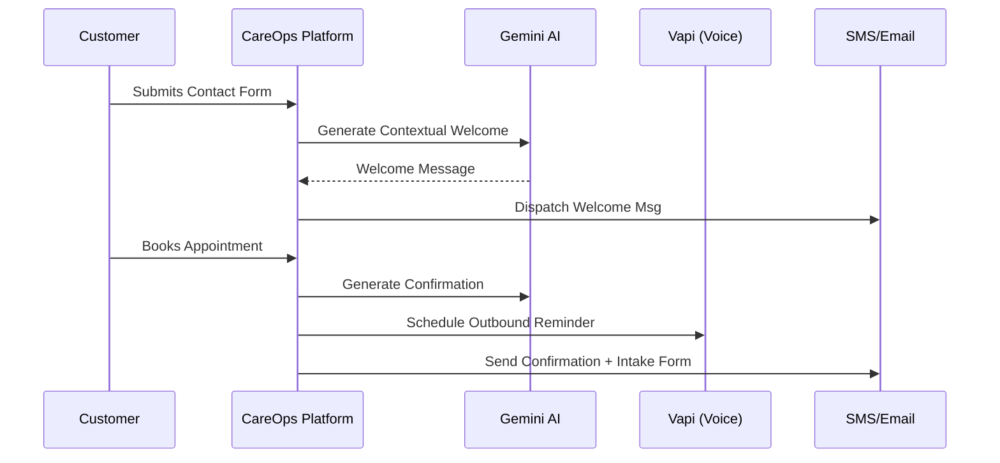

# CareOps: The SOTA Operations Engine

CareOps is a unified intelligence layer for service businesses, automating the full journey from first contact to final intake.

<p align="center">
  
  
  
  
  <a href="https://github.com/amarzeus/careops-app/actions">
    
  </a>
  <a href="https://github.com/amarzeus/careops-app">
    
  </a>
  <a href="https://github.com/amarzeus/careops-app">
    
  </a>
  
</p>

---

## 💎 The Future of Service Operations

CareOps is not just a dashboard; it's a **unified intelligence layer** for service businesses. By consolidating the entire operational lifecycle—from first contact to final intake—CareOps eliminates tool-chaos and replaces it with **automated clarity**.

---

## 🧩 How It Works: The 8-Step Automated Engine

CareOps is built on a strict, event-driven architecture that ensures no lead is ever dropped and no booking goes unconfirmed.



---

## 🔌 Integrated Ecosystem

CareOps leverages industrial-grade providers to power its communication and intelligence layers. Every integration is **abstracted**, **fail-safe**, and **event-driven**.

### 🚀 Provider Deep Dive

| Provider              | Role in CareOps           | Integration Logic                                                                                                         |
| :-------------------- | :------------------------ | :------------------------------------------------------------------------------------------------------------------------ |
| **Google Gemini 2.0** | **The SOTA Brain**        | Powers the `AI Onboarding Assistant`, `Smart Reply Engine`, `Inventory Forecasting`, and `Operational Anomaly Detection`. |
| **Vapi.ai**           | **Voice AI Receptionist** | Handles automated outbound reminders and voice-based booking confirmations via high-fidelity AI agents.                   |
| **Twilio**            | **Messaging Hub**         | Drives all SMS, WhatsApp, and OTP authentication flows with enterprise-grade deliverability.                              |
| **Google Calendar**   | **Availability Sync**     | Real-time two-way synchronization for all bookings, ensuring zero double-bookings.                                        |
| **Nodemailer**        | **Enterprise Email**      | Managed SMTP layer for automated intake forms, agreements, and vendor reorder alerts.                                     |
| **GitHub CLI**        | **CI/CD Visibility**      | Integrated verification suite ensuring local environments are synchronized with the repo's CI/CD health.                  |
| **Axe Core**          | **A11y Guard**            | Automated WCAG 2.1 compliance audits baked into the E2E pipeline via `@axe-core/playwright`.                              |

---

## 🛠️ Feature Spotlight

### 🧠 SOTA AI Brain

- **Intent Classification**: Automatically categorizes incoming messages (Inquiry vs. Urgent vs. Complaint).
- **Inventory Forecasting**: Predicts stock depletion based on booking volume and historical usage.
- **Micro-Onboarding**: An AI concierge guides business owners through the 8-step setup.

### 🎙️ Voice-First Engagement

- **Outbound Automation**: Automatically calls customers to remind them of upcoming appointments.
- **Hand-off Logic**: Seamlessly transfers AI voice calls to human staff when complexity arises.

### 📦 Precision Inventory

- **Vendor Alerts**: Automated emails sent to vendors when items hit critical thresholds.

### 🧪 Quality & Accessibility

- **Automated A11y**: Continuous WCAG auditing for all core user journeys (Auth, Pricing, Landing).
- **Maintenance Dashboard**: A rich CLI dashboard summarizing Build, Test, Lint, and Security health.
- **GH CLI Validation**: Automated checks for GitHub authentication and CI pipeline status.

---

---

## 🧪 Test Environment & Demo Credentials

To experience the full power of CareOps without manual setup, you can seed a comprehensive test clinic with realistic data.

### 🔐 Login Credentials

| Role      | Email                       | Password     |
| --------- | --------------------------- | ------------ |
| **OWNER** | `testowner@careops.test`    | `Test@1234`  |
| STAFF     | `jordan.smith@careops.test` | `Staff@1234` |
| STAFF     | `casey.lee@careops.test`    | `Staff@1234` |
| STAFF     | `morgan.chen@careops.test`  | `Staff@1234` |
| STAFF     | `riley.patel@careops.test`  | `Staff@1234` |
| STAFF     | `drew.kim@careops.test`     | `Staff@1234` |

### 📊 Seeded Workspace: "CareOps Test Clinic"

Run the following command to populate your local database:

```bash
npx dotenv -e .env -- npx ts-node --compiler-options '{"module":"commonjs"}' prisma/seed-test-account.ts
```

**What’s inside:**

- **Contacts:** 20 diverse contacts with message histories.
- **Bookings:** 12 bookings across all statuses (Confirmed, Pending, Completed, etc.).
- **Inventory:** 8 items, with 5 flagged as **Low Stock** (triggering alerts).
- **Automation:** All 6 PRD-defined automation rules pre-configured and active.
- **Forms:** 2 intake forms + 1 inquiry form with representative submissions.
- **Alerts:** 8 active alerts on the dashboard (Inventory, Booking, and Automation).

### 🌐 Public Access (Local)

- **Booking Page:** http://localhost:3000/book/cmlxxk4uf0000cvawxfjiqbkr
- **Contact Form:** http://localhost:3000/contact/careops-clinic-cmlxxk4u

---

## 🚀 Installation

Follow these steps to run CareOps locally in development:

1. Clone the repository and install dependencies.
2. Copy `.env.example` to `.env` and configure environment variables.
3. Provision and migrate the database.
4. (Optional) Seed demo data for a realistic workspace.
5. Start the development server.

```bash
git clone https://github.com/amarzeus/careops-app.git
cd careops-app
npm install

cp .env.example .env

npx prisma generate
npx prisma db push

npx tsx prisma/seed-live-business.ts

npm run dev
```

---

## 📦 Usage

- Access the app at `http://localhost:3000` (or the port configured via `PORT`).
- Register a new owner account or sign in with any accounts you have seeded.
- Explore the dashboard, inbox, bookings, forms, inventory, and automation tabs.

Common development commands:

```bash
# Run the complete Maintenance Suite (Critical before PRs)
# Includes: GH CLI, Lint, Type-check, Format, Unit, Build, E2E, A11y, Render, and Security
npm test

# Run Accessibility audits specifically
npm run test:a11y

# Run GitHub CLI verification
npm run test:gh

# Run End-to-End tests specifically
npm run test:e2e
```

---

## ⚙️ Configuration

CareOps is configured via environment variables. Copy `.env.example` to `.env` and fill in the values for your environment.

### Database

- `DATABASE_URL` – PostgreSQL connection string (or SQLite for local testing).

### Authentication

- `JWT_SECRET` – secret used to sign authentication tokens.

### AI Services

- `GEMINI_API_KEY` – Google Gemini API key.

### Email (SMTP)

- `EMAIL_HOST` – SMTP host (for example, Resend or Gmail).
- `EMAIL_PORT` – SMTP port (typically `587`).
- `EMAIL_USER` – SMTP username or identifier.
- `EMAIL_PASS` – SMTP password or API key.
- `EMAIL_FROM` – default from address for outbound emails.

### App

- `NEXT_PUBLIC_APP_URL` – public base URL of the app (used in links).

### Google OAuth

- `GOOGLE_CLIENT_ID` – OAuth client ID.
- `GOOGLE_CLIENT_SECRET` – OAuth client secret.

### SMS (Twilio)

- `TWILIO_ACCOUNT_SID` – Twilio account SID.
- `TWILIO_AUTH_TOKEN` – Twilio auth token.
- `TWILIO_PHONE_NUMBER` – Twilio sending phone number.

### Voice AI (Vapi)

- `VAPI_API_KEY` – Vapi API key for voice assistants.

### Testing

- `BASE_URL` – base URL used by Playwright tests.
- `TEST_ENV` – test environment label (for example, `local`).
- `API_URL` – base URL for API requests in tests.

---

## 🧪 Troubleshooting

- **Database connection errors**
  - Verify `DATABASE_URL` is correct and the database is running.
  - Run `npx prisma db push` to ensure the schema is applied.

- **Emails not sending**
  - Confirm `EMAIL_HOST`, `EMAIL_PORT`, `EMAIL_USER`, `EMAIL_PASS`, and `EMAIL_FROM` are set.
  - Check workspace email flags under Settings → Integrations.

- **SMS or voice features not working**
  - Make sure Twilio and Vapi environment variables are configured.
  - Verify your workspace is marked as SMS/voice enabled in settings.

- **AI features disabled or "High Volume" messages**
  - Ensure `GEMINI_API_KEY` is present and valid.
  - If using the **Free Tier**, you may hit rate limits (15 RPM). The app now handles this gracefully, but if problems persist, consider checking your quota at [Google AI Studio](https://aistudio.google.com/app/plan_pricing).
  - Restart the dev server after changing environment variables.

- **Tests failing locally**
  - Ensure the app is running on the same `BASE_URL` configured in `.env`.
  - Reset the database with `npx prisma db push` and re-run seeds if needed.

---

## 🤝 Contributing

CareOps is built with a focus on clean architecture and strong engineering discipline.

- Use TypeScript and React with Next.js 16.
- Prefer absolute imports via `@/` instead of deep relative paths.

### 🧪 Automated Quality Assurance

Before opening a pull request, you **must** ensure the entire application suite is stable. CareOps uses a high-integrity maintenance command that validates every layer of the system.

RUN THIS COMMAND BEFORE EVERY PULL REQUEST:

```bash
npm test
```

This command executes the following sequentially:

1.  **Linting**: Ensures code style consistency.
2.  **Type-checking**: Validates TypeScript integrity (`tsc`).
3.  **Formatting**: Verifies Prettier compliance.
4.  **Unit Tests**: Executes logic tests via Vitest.
5.  **Penetration Tests**: Runs a static penetration test for IDOR, XSS, and SQLi vectors.
6.  **E2E Tests**: Launches Playwright to verify critical routing and user flows.
7.  **Render Validation**: Validates deployment blueprints for Render.com.
8.  **Security Audit**: Checks for critical vulnerabilities in NPM dependencies.
9.  **Production Build**: Confirms that the code compiles successfully for production.

A detailed summary report will be generated at the end of the process to confirm your changes are ready for contribution.

To contribute:

1. Fork the repository.
2. Create a feature branch from `main`.
3. Make your changes and add tests.
4. Run linting and tests locally.
5. Open a pull request with a clear description and screenshots where relevant.

---

## 🧾 Changelog

- `0.1.0` – Initial public hackathon release of CareOps.

---

## 📚 Resources

- Live app: <https://careops-app.onrender.com>
- Repository: <https://github.com/amarzeus/careops-app>
- Next.js 16: <https://nextjs.org/docs>
- Prisma ORM: <https://www.prisma.io/docs>
- Google Gemini: <https://ai.google.dev>
- Twilio SMS: <https://www.twilio.com/docs/sms>
- Vapi Voice: <https://vapi.ai>

---

## 📄 License

This project is licensed under the MIT License. See the [LICENSE](https://github.com/amarzeus/careops-app/blob/main/LICENSE) file for details.

**Contact:** <https://careops-app.onrender.com>
