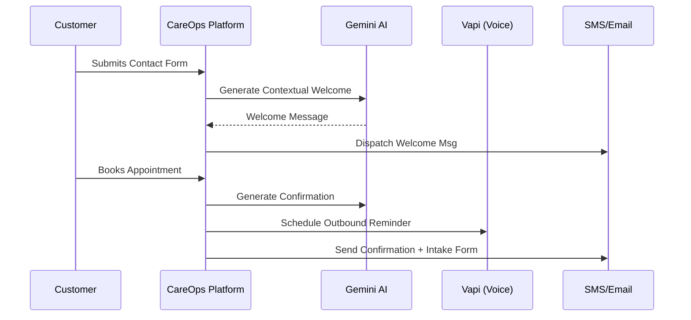

# <p align="center">🚀 CareOps: The SOTA Operations Engine</p>

<p align="center">
  
  
  
  
</p>

---

## 💎 The Future of Service Operations

CareOps is not just a dashboard; it's a **unified intelligence layer** for service businesses. By consolidating the entire operational lifecycle—from first contact to final intake—CareOps eliminates tool-chaos and replaces it with **automated clarity**.


---

## 🧩 How It Works: The 8-Step Automated Engine

CareOps is built on a strict, event-driven architecture that ensures no lead is ever dropped and no booking goes unconfirmed.




---

## 🔌 Integrated Ecosystem

CareOps leverages industrial-grade providers to power its communication and intelligence layers. Every integration is **abstracted**, **fail-safe**, and **event-driven**.


### 🚀 Provider Deep Dive

| Provider | Role in CareOps | Integration Logic |
| :--- | :--- | :--- |
| **Google Gemini 2.0** | **The SOTA Brain** | Powers the `AI Onboarding Assistant`, `Smart Reply Engine`, `Inventory Forecasting`, and `Operational Anomaly Detection`. |
| **Vapi.ai** | **Voice AI Receptionist** | Handles automated outbound reminders and voice-based booking confirmations via high-fidelity AI agents. |
| **Twilio** | **Messaging Hub** | Drives all SMS, WhatsApp, and OTP authentication flows with enterprise-grade deliverability. |
| **Google Calendar** | **Availability Sync** | Real-time two-way synchronization for all bookings, ensuring zero double-bookings. |
| **Nodemailer** | **Enterprise Email** | Managed SMTP layer for automated intake forms, agreements, and vendor reorder alerts. |

---

## 🛠️ Feature Spotlight

### 🧠 SOTA AI Brain
- **Intent Classification**: Automatically categorizes incoming messages (Inquiry vs. Urgent vs. Complaint).
- **Inventory Forecasting**: Predicts stock depletion based on booking volume and historical usage.
- **Micro-Onboarding**: An AI concierge guides business owners through the 8-step setup.

### 🎙️ Voice-First Engagement
- **Outbound Automation**: Automatically calls customers to remind them of upcoming appointments.
- **Hand-off Logic**: Seamlessly transfers AI voice calls to human staff when complexity arises.

### 📦 Precision Inventory
- **Usage Tracking**: Inventory is automatically deducted based on specific service types.
- **Vendor Alerts**: Automated emails sent to vendors when items hit critical thresholds.

---

## 🚀 Rapid Deployment

```bash
# 1. Clone & Install
```bash
git clone https://github.com/amarzeus/careops-app.git && cd careops-app
```
npm install

# 2. Environment (SOTA Keys Required)
cp .env.example .env
# Fill: GEMINI_API_KEY, VAPI_API_KEY, TWILIO_AUTH, etc.

# 3. Intelligent Database Sync
npx prisma generate
npx prisma db push

# 4. Launch the Engine
npm run dev
```

---

## 🎖️ CareOps Hackathon 2026
Built to set the standard for modern business operations. CareOps is a proof-of-concept for the **Founding Team** role, demonstrating elite AI leverage, UX obsessed design, and architectural discipline.

---
**License:** MIT | **Contact:** [https://careops-app.onrender.com](https://careops-app.onrender.com)
